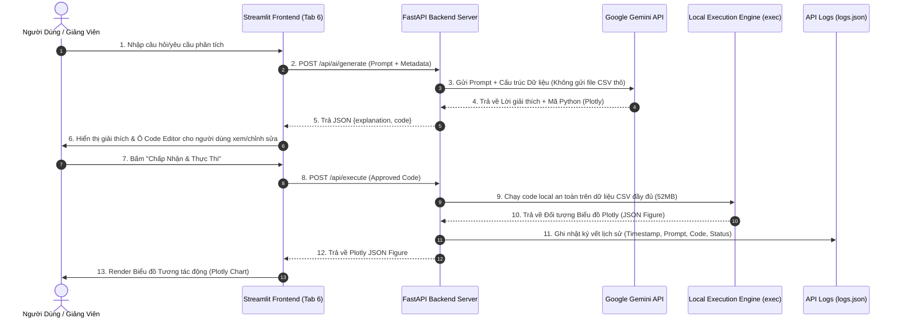

# 🌦️ Vietnam Climate Explorer & AI Assistance Dashboard (1991 - 2025)

> **Đồ án môn Trực quan hóa Dữ liệu (Data Visualization)**  
> _Báo cáo phân tích đặc điểm khí hậu giữa 6 nhóm vùng và 20 điểm tham chiếu tại Việt Nam kết hợp Trợ lý AI Phân tích (Human-in-the-Loop)._

---

## 1. Dataset được lựa chọn & Cấu tạo Dữ liệu

### 1.1. Nguồn dữ liệu (Dataset Source)

Dự án sử dụng bộ dữ liệu khí hậu theo ngày **NASA POWER (Prediction Of Worldwide Energy Resources)** được thu thập và làm sạch từ giai đoạn **1991 đến 2025 (35 năm)** tại Việt Nam.

### 1.2. Cấu trúc & Phạm vi bao phủ

- **Phạm vi không gian:** 20 địa điểm tham chiếu đại diện bao phủ trọn vẹn **6 Vùng khí hậu chính tại Việt Nam**:
  1. _Tây Bắc_ (Sơn La, Sa Pa, Lai Châu...)
  2. _Đông Bắc_ (Hà Giang, Cao Bằng, Lạng Sơn...)
  3. _Đồng bằng sông Hồng_ (Hà Nội, Hải Phòng, Ninh Bình...)
  4. _Bắc Trung Bộ_ (Thanh Hóa, Vinh, Huế...)
  5. _Duyên hải Nam Trung Bộ_ (Đà Nẵng, Quy Nhơn, Nha Trang...)
  6. _Tây Nguyên_ (Đà Lạt, Pleiku, Buôn Ma Thuột...)
- **Phạm vi thời gian:** Dữ liệu theo ngày chuỗi thời gian 35 năm (1991 - 2025).
- **Các thông số khí tượng cốt lõi trong Dataset:**
  - `T2M`, `T2M_MAX`, `T2M_MIN`: Nhiệt độ trung bình, cực đại và cực tiểu ở độ cao 2m (°C).
  - `PRECTOTCORR`: Lượng mưa tích lũy hàng ngày (mm/day).
  - `RH2M`: Độ ẩm tương đối (%) ở độ cao 2m.
  - `WS10M`: Tốc độ gió ở độ cao 10m (m/s).
  - `PS`: Áp suất bề mặt (kPa).
  - `ALLSKY_SFC_SW_DWN`: Bức xạ mặt trời bề mặt (MJ/m²/ngày).

---

## 2. Hướng dẫn Thiết lập Môi trường & Khởi chạy

### 2.1. Yêu cầu môi trường (Prerequisites)

- Python **3.10** trở lên.
- Quản lý gói `pip`.

### 2.2. Danh sách Packages yêu cầu (`requirements.txt`)

Dự án sử dụng các thư viện chính:

```text
streamlit          # Framework xây dựng Giao diện Dashboard (Frontend)
pandas             # Thao tác và xử lý dữ liệu bảng
numpy              # Tính toán số học và mảng
plotly             # Khởi tạo biểu đồ tương tác 2D/3D (Express & Graph Objects)
fastapi            # Xây dựng RESTful API Server (Backend)
uvicorn[standard]  # ASGI Web Server phục vụ FastAPI
google-genai       # Google Gemini LLM SDK
python-dotenv      # Đọc cấu hình biến môi trường từ .env
requests           # Kết nối HTTP giữa Streamlit và FastAPI
```

Cài đặt tất cả phụ thuộc bằng một lệnh duy nhất:

```bash
pip install -r requirements.txt
```

### 2.3. Cấu hình biến môi trường (`.env`)

Tạo file `.env` tại thư mục gốc và điền Gemini API Key của bạn (Lấy tại [Google AI Studio](https://aistudio.google.com/)):

```env
GEMINI_API_KEY=your_gemini_api_key_here
```

### 2.4. Quy trình vận hành hệ thống (2 Terminals)

Đồ án được phân tách kiến trúc rõ ràng giữa Backend API và Frontend Streamlit. Cần mở **2 cửa sổ Terminal** để vận hành:

#### 🟢 Terminal 1: Khởi chạy Backend API (FastAPI)

```bash
uvicorn api.main:app --reload --reload-dir api --port 8000
```

> _Backend sẽ chạy tại cổng `http://localhost:8000`. Xem tài liệu Swagger API tại `http://localhost:8000/docs`._

#### 🔵 Terminal 2: Khởi chạy Giao diện Dashboard (Streamlit)

```bash
streamlit run app.py
```

> _Ứng dụng web sẽ tự động mở trên trình duyệt tại `http://localhost:8501`._

---

## 3. Cấu trúc Folder & Mô hình Luồng Hoạt Động (Flow Architecture)

### 3.1. Cấu trúc thư mục dự án

```text
nasa-climate-analysis/
├── api/                             # Backend API Module (FastAPI)
│   ├── main.py                      # RESTful endpoints: /api/ai/generate, /api/execute, /api/logs
│   └── logs.json                    # Kho lưu trữ API Logs lịch sử thực thi
├── data/                            # Thư mục lưu trữ dữ liệu
│   └── nasa_power_vietnam_daily_clean.csv # Dataset khí hậu làm sạch (52MB)
├── tabs/                            # Các Module Giao diện Tab phân tích
│   ├── tab_1_overview_regions.py    # Tab 1: Tổng quan 6 Vùng & Địa điểm
│   ├── tab_2_temperature_comparison.py # Tab 2: Phân tích Nhiệt độ
│   ├── tab_3_rainfall_humidity.py   # Tab 3: Phân tích Mưa & Độ ẩm
│   ├── tab_4_meteorological_factors.py # Tab 4: Yếu tố Khí tượng (Gió, Áp suất, Bức xạ)
│   ├── tab_5_extreme_weather.py     # Tab 5: Thời tiết Cực đoan
│   └── tab_6_ai_assistant.py        # Tab 6: Trợ lý AI Phân tích (Human-in-the-Loop)
├── app.py                           # File chính khởi chạy ứng dụng Streamlit
├── sidebar.py                       # Giao diện bộ lọc Sidebar chung
├── requirements.txt                 # Danh sách thư viện phụ thuộc
├── .env                             # Khai báo biến môi trường chứa API Key
└── README.md                        # Tài liệu hướng dẫn đồ án
```

### 3.2. Mô hình Luồng Hoạt động (System Architecture Flow)

Đồ án tuân thủ nghiêm ngặt nguyên tắc **Human-in-the-Loop** (Con người phê duyệt trước khi thực thi) và **Không thực thi ngầm**:



---

## 4. Kết luận Sản phẩm

Đồ án **Vietnam Climate Explorer & AI Assistance Dashboard** đã thực hiện mục tiêu phân tích dữ liệu trực quan hóa khí hậu và tích hợp AI nâng cao:

1. **Trực quan hóa Khí hậu Toàn diện (Tabs 1-5):** Khai thác chiều sâu biến đổi khí hậu 35 năm (1991 - 2025) qua 6 nhóm vùng khí hậu tại Việt Nam với hệ thống biểu đồ động Plotly phong phú (Scatter plot, Line trendline, Heatmap tương quan, Boxplot phân bố).

2. **Tích hợp AI Chuẩn mực (Tab 6):** Triển khai mô hình **Human-in-the-Loop** cho phép con người kiểm tra, chỉnh sửa tham số mã nguồn Python do Gemini AI gợi ý trước khi quyết định thực thi.

3. **Tuân thủ Quy định thực thi xây dựng trợ lý AI:**
   - Không thực thi ngầm mã nguồn.
   - Không gửi file dữ liệu thô ra internet (chỉ gửi siêu dữ liệu metadata).
   - Lưu trữ đầy đủ **API Logs** lịch sử thao tác phục vụ kiểm tra và vấn đáp.

## 5. Credit

Đây là sản phẩm đồ án thuộc quyền sở hữu của nhóm sinh viên **Trường Đại học Khoa Học Tự Nhiên - Đại học Quốc gia TPHCM** trong bộ môn **Trực Quan Hóa Dữ Liệu** của khóa 2023.
Không được xây dựng cho mục đích thương mại và thực tế hóa kết quả của sản phẩm.

@DataVisualization-K2023-HCMUS-2025-2026
